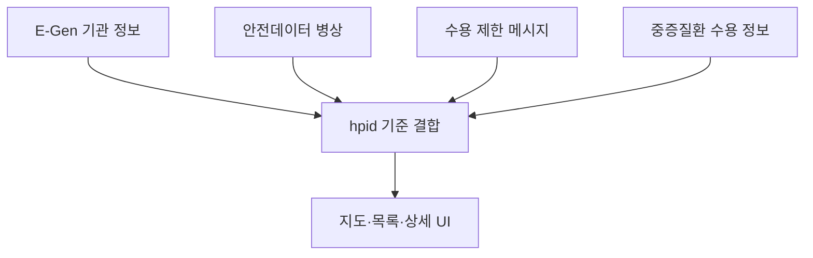

# FindEr — 응답하라 응급실

> 흩어진 응급실 위치·병상·수용 정보를 병원 식별자(`hpid`)로 결합해, 주변 응급실을 지도에서 비교하는 개인 프로젝트입니다.

응급실 뺑뺑이가 나와 주변에도 생길 수 있는 문제라고 느껴 시작했습니다. 기존 병상 현황 사이트에서는 **지금 내 주변에 어떤 응급실이 있고, 데이터가 얼마나 최근 것이며, 어떤 진료를 받을 수 있는지**를 한 화면에서 판단하기 어려웠습니다.

FindEr는 E-Gen의 기관 정보와 수용 정보를 안전데이터의 병상 스냅샷과 결합해 거리순으로 보여줍니다. 병상과 수용 정보는 실제 진료 가능성을 보장하는 값이 아니므로, 갱신 시각과 확인할 수 없는 상태를 함께 표시합니다.

> **[find-er.info에서 서비스 확인하기](https://find-er.info)**

> [!CAUTION]
> FindEr의 정보는 응급의료기관이 공공 API에 제공한 값을 재구성한 참고 자료이며, 실제 진료·수용 가능 여부를 보장하지 않습니다. 위급한 상황에서는 이 서비스로 자가 판단하지 말고 **119에 연락하세요.**

## 프로젝트 요약

| 구분 | 내용 |
|---|---|
| 형태 | 개인 프로젝트 · 기획, 프론트엔드, 백엔드, 배포 |
| 대상 | 위급한 상황에 응급실 진료가 필요한 환자·보호자 |
| 상태 | 웹 배포 |
| 서비스 | [find-er.info](https://find-er.info) |
| Backend | Java 17, Spring Boot 3.5, Gradle |
| Frontend | React 19, Vite 8, Kakao Maps JavaScript SDK |
| Infra | AWS EC2, GitHub Actions, MySQL 설정 |
| Data | E-Gen 공공데이터 API, 안전데이터 실시간 병상정보 API |

## 사용 흐름

1. GPS 또는 장소 검색으로 탐색 기준 위치를 정합니다.
2. 반경 안의 응급실을 지도와 거리순 목록으로 확인합니다.
3. 가용 병상, 갱신 시각, 수용 제한 메시지와 가능한 처치를 함께 비교합니다.
4. 병원 상세 정보를 확인하고 전화 또는 카카오맵 길찾기로 이어집니다.

> 실제 서비스 화면 GIF와 주요 화면 캡처는 공개 가능한 데이터를 확인한 뒤 추가할 예정입니다.

## 핵심 구현

### 1. 분산된 공공데이터를 하나의 조회 모델로 결합

기관 위치·연락처, 실시간 병상, 수용 제한 메시지, 중증질환 수용 가능 정보는 서로 다른 API에서 옵니다. 각 응답을 공통 병원 식별자 `hpid`로 결합하고, 프론트엔드가 한 번에 사용할 수 있는 목록·상세 응답으로 만들었습니다.



### 2. 요청 경로와 외부 API 갱신 경로를 분리

사용자 요청마다 여러 공공 API를 연쇄 호출하면 응답 시간과 외부 장애의 영향을 그대로 받습니다. 그래서 조회 요청은 메모리 캐시만 조합하고, 외부 API 갱신은 별도 스케줄러가 담당하도록 분리했습니다.

| 데이터 | 갱신 주기 | 실패 시 동작 |
|---|---:|---|
| 기관 기본정보 | 24시간 | 기존 캐시 유지 |
| 실시간 병상 | 3분 | 기존 캐시 유지 |
| 수용 제한 메시지 | 5분 | 기존 캐시 유지 |
| 중증질환 수용 가능 정보 | 1시간 | 기존 캐시 유지, 캐시가 비었을 때만 1분 후 재시도 |

캐시가 정상 적재된 목록 조회 경로에서는 외부 API를 직접 호출하지 않습니다. 초기 적재가 되지 않은 경우에만 E-Gen 위치 조회를 폴백으로 사용합니다.

### 3. 오래되거나 비정상인 병상 정보를 구분

공공 API에는 음수 병상값이나 오래 갱신되지 않은 값이 포함될 수 있습니다. 병상 데이터가 **30분을 초과해 오래됐거나**, 갱신 시각이 없거나, 가용 병상 수가 음수라면 `UNKNOWN`으로 분류합니다.

| 상태 | 기준 | 화면 표현 |
|---|---|---|
| `GREEN` | 가용 응급실 병상 4개 이상 | 초록 |
| `YELLOW` | 1–3개 | 노랑 |
| `RED` | 0개 | 빨강 |
| `UNKNOWN` | 오래됨·시각 없음·음수·데이터 없음 | `정보 없음`으로 명확히 표시 |

상세 화면의 병상·입원실·중환자실 수치도 같은 기준으로 `정보 없음`으로 표시합니다. 장비 정보는 병상 스냅샷을 사용할 수 없을 때 E-Gen 기관 기본정보로 폴백합니다.

### 4. 외부 API의 불완전한 응답을 방어

- 단건일 때 객체, 복수일 때 배열로 오는 E-Gen 응답을 모두 처리합니다.
- 인증 오류가 XML로 돌아오는 경우와 정상적인 0건 응답을 구분해 로그를 남깁니다.
- 간헐적인 전송 실패가 있는 병상·중증질환 API는 최대 3회 재시도합니다.
- 갱신 결과가 비어 있거나 실패하면 정상 캐시를 빈 값으로 덮어쓰지 않습니다.

## 프로젝트 범위

처음에는 병상 정보 접근성이 응급실을 찾기 어려운 문제의 핵심이라고 생각해, 분산된 정보를 하나의 API와 지도 화면으로 결합했습니다. 구현을 마친 뒤에는 병상 숫자만으로 환자 상태·의료진·장비·진료 가능 여부와 이송 과정을 설명할 수 없다는 점을 확인했습니다.

FindEr가 다루는 범위는 주변 응급실의 위치·데이터 시점·수용 관련 정보를 비교하기 쉽게 정리하는 것입니다. 실제 병원의 수용 여부나 응급의료 체계의 문제를 해결하거나 보장하지 않습니다.

## 현재 한계

- 병원 자체 갱신이 늦으면 서비스가 더 최신 정보를 만들 수 없습니다.
- 공개 데이터와 실제 수용 판단 사이에는 환자 상태, 의료진, 장비, 병상 운영 등 서비스가 알 수 없는 조건이 있습니다.
- 캐시는 프로세스 메모리에 있어 서버 재시작 직후 다시 적재해야 합니다.
- 현재 배포 파이프라인은 단일 EC2 백엔드를 대상으로 하며, 프론트엔드 배포는 별도입니다.
- 사용자 인터뷰와 실제 응급실 이용 흐름 검증이 충분하지 않았습니다.

## 실행 방법

### Backend

필수 환경변수:

```bash
export DB_URL='jdbc:mysql://localhost:3306/finder'
export DB_USERNAME='finder'
export DB_PASSWORD='...'
export EGEN_API_KEY='...'
export BED_API_KEY='...'

cd backend
./gradlew bootRun
```

### Frontend

`frontend/.env.local`:

```dotenv
VITE_KAKAO_JS_KEY=...
VITE_API_BASE_URL=http://localhost:8080
```

```bash
cd frontend
npm install
npm run dev
```

## 문서

- [아키텍처와 캐시 전략](docs/architecture.md)
- [내부 API 명세](docs/api-spec.md)
- [외부 API 연동](docs/external-api.md)
- [데이터 저장 방식](docs/db-schema.md)
- [프론트엔드 구조](frontend/README.md)

## 검증

```bash
cd backend
./gradlew test

cd ../frontend
npm run lint
npm run build
```

현재 테스트는 외부 API 파싱·재시도, 중증질환 캐시 갱신, 병상 상태와 오래된 병상값의 `정보 없음` 처리를 중심으로 구성되어 있습니다.
