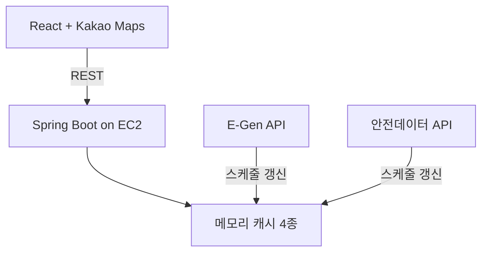
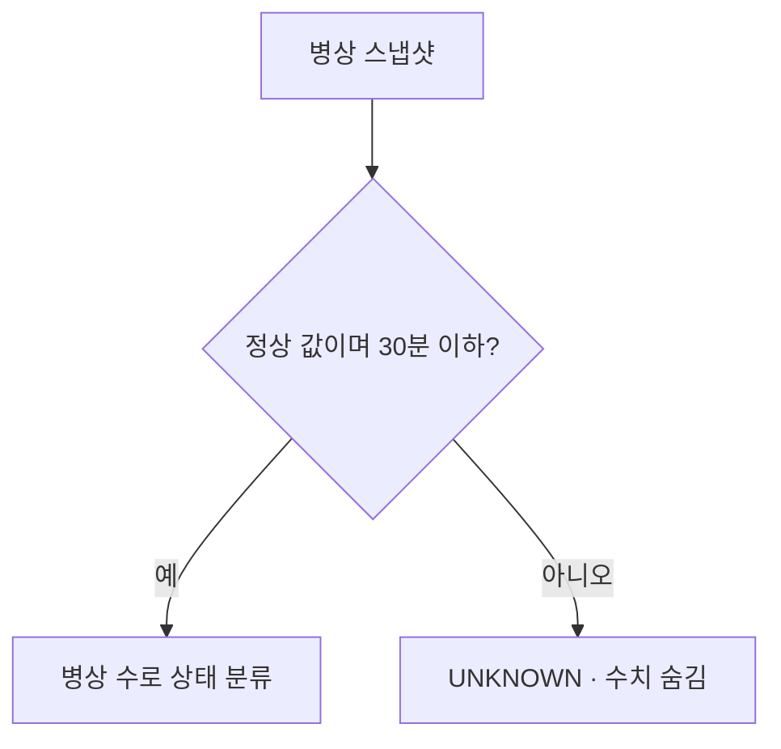

# 아키텍처와 데이터 신뢰성 전략

## 시스템 구성

프론트엔드는 사용자의 위치와 반경만 백엔드에 전달합니다. 백엔드는 기관 기본정보, 병상 스냅샷, 수용 제한 메시지, 중증질환 수용 가능 코드를 `hpid`로 결합해 반환합니다.

현재 MySQL/JPA 의존성은 설정되어 있지만 병원 데이터는 영속화하지 않습니다. 운영 데이터는 모두 프로세스 메모리의 스냅샷 캐시에 있습니다.

## 조회 흐름

### 목록 조회

1. `lat`, `lng`, `radius`를 받습니다.
2. 기관 기본정보 캐시의 각 병원까지 Haversine 거리를 한 번씩 계산합니다.
3. 반경 안의 병원을 거리순으로 정렬합니다.
4. `hpid`를 기준으로 병상, 차단 메시지, 수용 가능 처치 코드를 결합합니다.
5. 병상 수와 갱신 시각으로 `GREEN`, `YELLOW`, `RED`, `UNKNOWN`을 계산합니다.

기관 캐시가 정상 적재된 목록 조회에서는 외부 API 호출이 없습니다. 캐시가 비어 있을 때만 E-Gen 위치 조회 결과를 임시 소스로 사용합니다.

### 상세 조회

1. 기관 캐시에서 `hospitalId`를 찾습니다.
2. 없으면 E-Gen 기본정보 단건 조회를 한 번 시도합니다.
3. 병상·차단 메시지·수용 가능 처치 캐시를 결합합니다.
4. 기관도 찾지 못하면 `404`를 반환합니다.

## 캐시와 갱신 주기

| 캐시 | 소스 | 주기 | 비고 |
|---|---|---:|---|
| `HospitalInfoCache` | E-Gen 기관·응급실 식별자 | 24시간 | 좌표, 주소, 연락처, 장비 기본정보 |
| `BedInfoCache` | 안전데이터 병상정보 | 3분 | 병상·입원실·중환자실 수와 갱신 시각 |
| `BlockMessageCache` | E-Gen 차단 메시지 | 5분 | 현재 유효한 수용 제한 메시지만 조회 시 필터링 |
| `SeverePossibilityCache` | E-Gen 중증질환 수용정보 | 1시간 | 17개 시도를 순회해 `mkioskty1..28` 코드 수집 |

중증질환 캐시가 비어 있으면 1분 주기의 콜드 스타트 재시도를 별도로 수행합니다. 스케줄러는 4개 스레드를 사용해 긴 전국 단위 조회가 다른 캐시 갱신을 막지 않도록 합니다.

## 실패 처리

- 갱신 결과가 비어 있으면 기존 캐시를 빈 값으로 교체하지 않습니다.
- 안전데이터 병상 API와 E-Gen 중증질환 API의 일시 오류는 최대 3회 재시도합니다.
- E-Gen의 XML 인증 오류와 JSON 비정상 결과 코드를 정상 0건 응답과 구분합니다.
- 메모리 캐시이므로 프로세스를 재시작하면 다시 적재해야 합니다.

## 병상 데이터 신뢰성 규칙

병상 수치는 사용자의 판단에 직접 영향을 줄 수 있어, 오래된 값을 유효한 값처럼 보여주지 않습니다.

- 갱신 시각이 현재보다 30분을 **초과**하면 `UNKNOWN`입니다.
- 안전데이터의 갱신 시각은 한국 시각으로 해석해, 서버 기본 타임존이 UTC여도 같은 기준으로 비교합니다.
- 갱신 시각이 없거나 가용 응급실 병상이 음수여도 `UNKNOWN`입니다.
- 목록의 병상 수와 상세의 모든 병상·입원실·중환자실 수치를 숨깁니다.
- 장비 정보는 병상 스냅샷이 유효하면 그 값을, 그렇지 않으면 E-Gen 기관 기본정보 값을 사용합니다.
- 프론트엔드도 `stale` 값을 다시 확인해 오래된 수치를 방어적으로 숨깁니다.

## 배포 경계

- `main` push 시 GitHub Actions가 백엔드 JAR을 빌드해 단일 EC2에 전달하고 systemd 서비스를 재시작합니다.
- 현재 워크플로는 `-x test`로 배포 빌드에서 테스트를 제외합니다. 따라서 PR 단계에서 테스트를 별도로 확인해야 합니다.
- 프론트엔드 배포는 이 백엔드 워크플로에 포함되지 않습니다.
